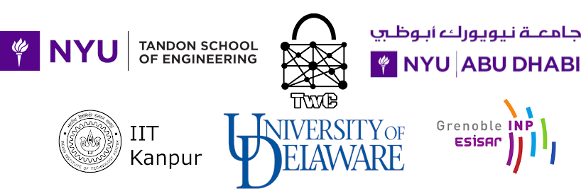

CSAW 2026 Embedded Security Challenge (ESC)
===========================================

## **Qualification report deadline extended to 28 September 2026 (firm)

## Quick Links

* [ESP32 Arduino Docs](https://docs.espressif.com/projects/arduino-esp32/en/latest/)
* [Deliverables](https://github.com/TrustworthyComputing/csaw_esc_2026/blob/main/deliverables.md)
* [Deadlines/Logistics](https://github.com/TrustworthyComputing/csaw_esc_2026/blob/main/logistics.md#competition-deadlines)
* [Challenge Description](https://github.com/TrustworthyComputing/csaw_esc_2026/blob/main/Challenge_Description.md)
* [csaw.io/esc](https://www.csaw.io/esc)

## Overview

The Embedded Security Challenge (ESC) returns in 2026 for the 19th time, and we are proud to announce another exciting and educational global competition! ESC is part of [CSAW](https://www.csaw.io/), which is founded by the department of Computer Science and Engineering at NYU Tandon School of Engineering, and is the most comprehensive student-run cyber security event in the world, featuring international competitions, workshops, and industry events.

ESC 2026 will be held in multiple regions: US-Canada, Europe, and India, with the finals taking place in November 2026. The organizers for each region are:

-   **CSAW US-Canada**: NYU Tandon School of Engineering, Brooklyn, USA.
-   **CSAW Europe**: Grenoble Institute of Technology - ESISAR, Grenoble, France.
-   **CSAW India**: Indian Institute of Technology Kanpur, Kanpur, India.

The competition is organized in all regions under the supervision of Professor Nektarios Tsoutsos (University of Delaware), with Dimitris Papaderakis and Nikolas Moraitis as the main ESC Contributors.
In Europe, the competition is organized by Amir-Pasha Mirbaha (Grenoble INP).
In India, ESC is supervised by Professors Debapriya Basu Roy and Urbi Chatterjee (IIT Kanpur), with Dipesh as the regional challenge lead.

## Challenge Summary

**This year, we are unleashing the power of AI:** participants are encouraged to leverage deep learning and Large Language Models to automate attacks, and design intelligent defenses in a new AI-driven computing era. This year's challenge focuses on securing a modern **Smart Home Edge Gateway** implemented on the popular **ESP32** platform. Participants will analyze and secure an embedded firmware that manages multiple communication interfaces and physical access control subsystems. The 2026 competition comprises a qualification phase and a final phase, where finalist teams receive hardware kits to learn about hardware attacks in a controlled and safe environment using an **ESP32** development board.

Further details and specifics can be found on the [challenge description](Challenge_Description.md) page.

## Registration

Students of all university levels are invited to compete. Each team must have a **team leader** and up to 3 additional team members (a total of 4 participants per team). Each team leader is responsible for coordinating with other members of their team and will be the point of contact for the entire team. Each team should also have a university **faculty advisor**.

The team leaders need to register their team members and faculty advisor electronically at https://hotcrp.engineering.nyu.edu/, using their team name as the 'Submission Title'. ESC uses a HotCRP-based registration and submission system for both the qualification and final rounds, and teams **must register before finalizing their report and computer file submissions** by the posted deadlines.

Each team is eligible to register for **only one region** based on university affiliation: Europe, India, or US-Canada, as defined below.
While team members do not need to attend the same university, all team members must be a part of the same region.

-   **US-Canada**: Hosting students from universities located within the United States or Canada.
-   **Europe:** Hosting students from universities located in the European Union, Switzerland, Norway, Armenia, and the United Kingdom.
-   **India:** Hosting students from universities located in India.

To qualify for the final round, each team must register for the correct region based on the university affiliations of its members.

After registration closes, making changes to the existing members of a team (e.g., replacing a team member) or adding new team members, requires explicit permission from the organizers. This also applies for teams replacing team members or adding new team members during the final round of the competition.

For more registration information, policies, deadlines, and for information for contacting CSAW organizers, visit the [logistics](logistics.md) page. For information about final phase submissions, please visit the [deliverables](deliverables.md) page.

**Teams are encouraged to start investigating the challenge as early as possible.**

*It is also recommended to periodically visit this repository on GitHub, as the details may be updated*.

---

## Acknowledgments
The development of this competition was supported by the National Science Foundation (Awards #2234974, #2336586).

## Partner institutions

    

[badge-license]: https://img.shields.io/badge/license-MIT-green.svg
