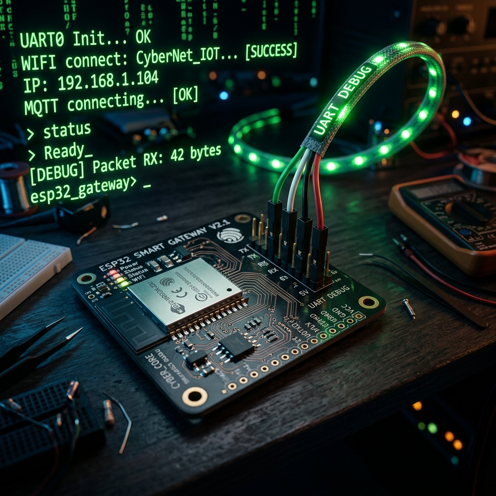
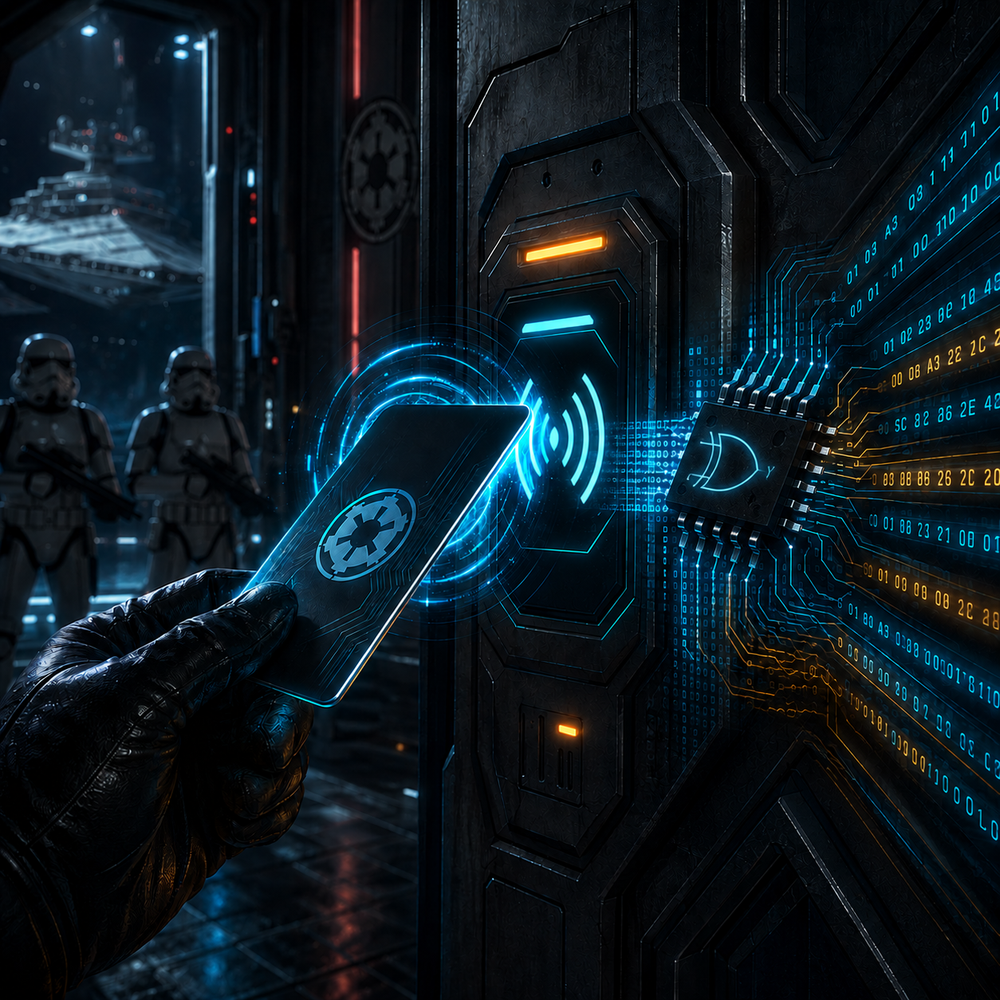

# Embedded Security Challenge 2026 - Set 1

Welcome to Embedded Security Challenge 2026!! This year we go on-device. Every team gets the same ESP32 board and peripherals but each challenge ships its own firmware image and drops you somewhere new, so flash the image for the challenge you are on and read every one of them fresh.

Before you start, make sure your board is assembled and healthy. The [Setup](../README.md#setup) section walks you through the toolchain, the wiring, and the built-in self-test. Always start your challenges by connecting to UART and pressing the EN (reset) button.

| # | Challenge | Points |
|---|---|---|
| 1 | [Serial Gateway](#serial-gateway-100-pts) | 100 |
| 2 | [EEPROM Secrets](#eeprom-secrets-200-pts) | 200 |

---

The first two are ready to kick off your journey.

## Serial Gateway (100 pts)

While rushing to deploy the Smart Home Gateway, developers left a door exposed on the physical setup interface. Getting inside won't be easy - connect to the serial console (UART) and learn to speak its language. When authentication is needed you can look around, the gateway continuously advertises its identity. There is no reason to make unnecessary connections, don't waste your time. After you pass through the door, precious secrets will be revealed.

 

## EEPROM Secrets (200 pts)

Wondering how to get in? Just tap your card. But beware! This Imperial garrison strictly obeys High Command. The guards won't unlock the blast doors unless your identity chip proves you've received clearance from their Master. Unfortunately, the Master (aka the Lord Commander) is away aboard his Star Destroyer, so you can't ask nicely. Your only option is to trick the security system into believing you've already earned his blessing. To pull off a deception of this magnitude, you'll need to dig deep into the gateway's non-volatile memory first. Help us... you are our only hope

 
